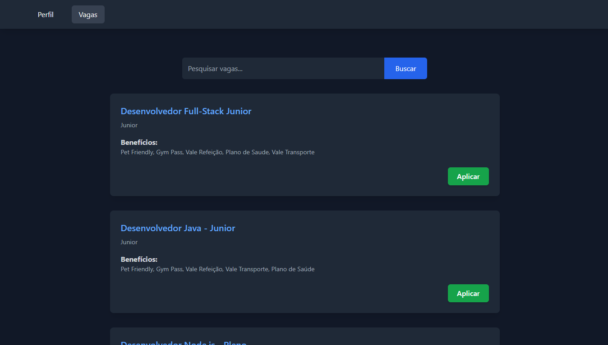
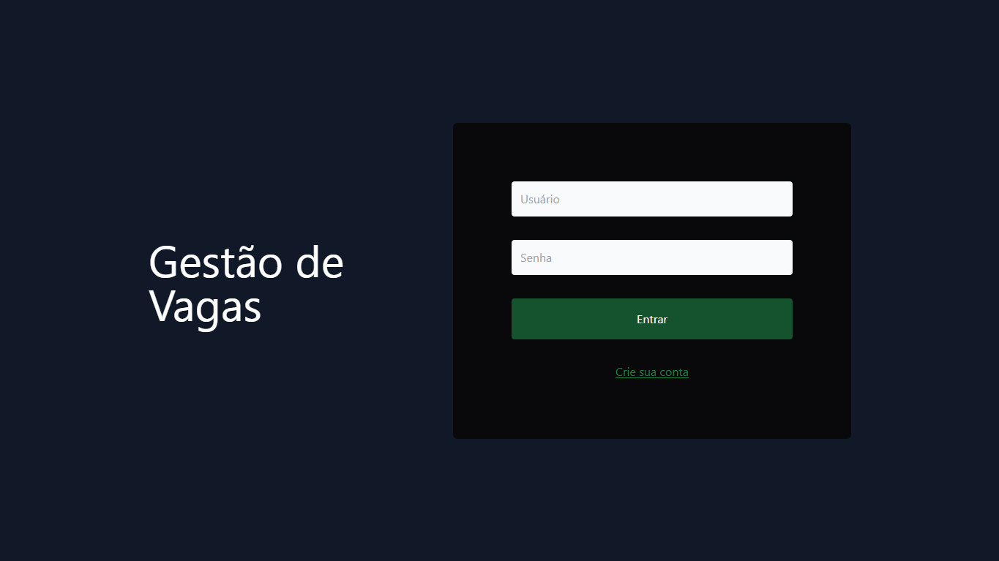

# 💼 Javagas

A interface web do **Javagas**, uma plataforma completa de gestão de vagas de emprego. Essa aplicação permite que **candidatos** criem perfis, se candidatem a oportunidades e acompanhem suas candidaturas, enquanto **empresas** podem publicar vagas, gerenciar seus anúncios e visualizar os perfis dos candidatos. O front-end foi desenvolvido com **Java**, **Spring Boot**, **Thymeleaf** e estilizado com **TailwindCSS** para uma experiência fluida e responsiva.

---

## 🖼️ Imagens do Projeto

  

  
  

> 🔗 Este repositório representa a **camada de apresentação (front-end)** da aplicação Javagas. Para acessar o back-end, [clique aqui](https://github.com/joschonarth/javagas-api).

## 🛠️ Tecnologias Utilizadas

- ☕ **Java** - Linguagem base da aplicação.
- 🌱 **Spring Boot** - Estrutura principal do projeto.
- 🌸 **Thymeleaf** - Template engine para renderização de páginas dinâmicas.
- 🎨 **TailwindCSS** - Framework utilitário para estilização moderna e responsiva.
- 🔐 **Spring Security** - Para controle de acesso na interface.
- 📦 **Maven** - Gerenciador de dependências.

---

## ⚙️ Funcionalidades

### 🧑‍💻 Candidato

- 👤 **Criar um candidato**: Registra um novo candidato na plataforma.
- 🔐 **Autenticar candidato**: Realiza o login de um candidato.
- 🔎 **Buscar perfil de um candidato**: Retorna as informações do candidato autenticado.

### 🏢 Empresa

- 🏢 **Criar empresa**: Cadastra uma nova empresa no sistema.
- 🔐 **Autenticar empresa**: Permite que empresas realizem login.

### 💼 Vagas

- 📝 **Criar vaga**: Publica uma nova oportunidade de emprego.
- 📋 **Listar vagas**: Retorna todas as vagas disponíveis na plataforma.

---
